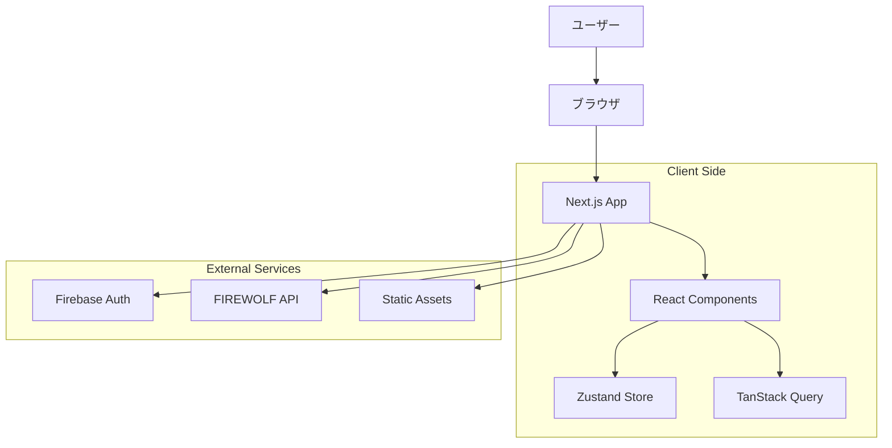
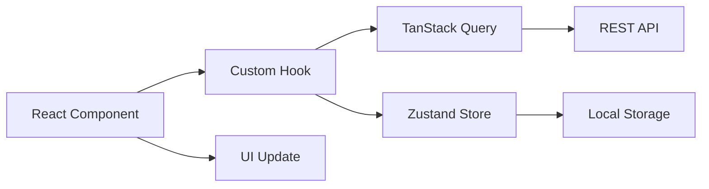

# アーキテクチャドキュメント

このドキュメントでは、FIREWOLF UI v2のシステム設計と技術選定について詳しく説明します。

## システム概要

FIREWOLF UI v2は、人狼ゲームのWebアプリケーションフロントエンドとして設計されています。リアルタイム性、スケーラビリティ、保守性を重視したモダンなSPAアーキテクチャを採用しています。

## 全体アーキテクチャ



## 技術スタック選定理由

### フロントエンドフレームワーク

#### Next.js 15 (App Router)
**選定理由:**
- **SSR/SSG対応**: SEOとパフォーマンス向上
- **App Router**: 最新のReact機能（Server Components等）を活用
- **ファイルベースルーティング**: 直感的な開発体験
- **Built-in最適化**: 画像、フォント、バンドルの自動最適化
- **TypeScript標準対応**: 型安全性の向上

**v1との比較:**
- Nuxt.js 2 → Next.js 15: モダンなReactエコシステム活用
- Pages Router → App Router: より効率的なデータフェッチング

#### React 19
**選定理由:**
- **最新機能**: Suspense、Concurrent Features等
- **パフォーマンス**: 自動バッチング、メモ化の改善
- **開発体験**: より良いエラーハンドリング、DevTools
- **エコシステム**: 豊富なライブラリとツール

### 状態管理

#### Zustand
**選定理由:**
- **軽量**: Reduxより小さなバンドルサイズ
- **シンプル**: ボイラープレートコードが少ない
- **TypeScript**: 優れた型推論
- **学習コスト**: Redux比で低い学習コスト

```typescript
// 例: 認証ストア
interface AuthState {
  user: User | null
  isLoading: boolean
  login: (user: User) => void
  logout: () => void
}

const useAuthStore = create<AuthState>((set) => ({
  user: null,
  isLoading: false,
  login: (user) => set({ user }),
  logout: () => set({ user: null }),
}))
```

#### TanStack Query
**選定理由:**
- **サーバー状態管理**: キャッシュ、同期、バックグラウンド更新
- **パフォーマンス**: 効率的なデータフェッチング
- **開発体験**: 優れたDevTools
- **エラーハンドリング**: 統一されたエラー処理

```typescript
// 例: 村データの取得
function useVillageQuery(villageId: string) {
  return useQuery({
    queryKey: ['village', villageId],
    queryFn: () => apiClient.getVillage({ villageId }),
    staleTime: 30 * 1000, // 30秒
  })
}
```

### スタイリング

#### Tailwind CSS
**選定理由:**
- **Utility-First**: 高い開発効率とデザインの一貫性
- **カスタマイズ性**: テーマシステムによる柔軟な設定
- **パフォーマンス**: PurgeCSSによる未使用スタイルの除去
- **保守性**: CSSファイルの肥大化防止

#### shadcn/ui
**選定理由:**
- **コピー＆ペーストベース**: 必要なコンポーネントのみ追加
- **カスタマイズ性**: 完全にカスタマイズ可能
- **アクセシビリティ**: WAI-ARIAに準拠した実装
- **TypeScript**: 型安全性

### API通信

#### openapi-fetch + openapi-typescript
**選定理由:**
- **型安全性**: OpenAPI仕様から自動で型生成
- **一貫性**: APIとフロントエンドの仕様統一
- **保守性**: API変更の自動検出
- **開発効率**: 型補完による開発支援

```typescript
// 自動生成された型を使用
import type { paths } from '@/types/generated/api'
import createClient from 'openapi-fetch'

const apiClient = createClient<paths>({
  baseUrl: process.env.NEXT_PUBLIC_API_BASE_URL,
})

// 型安全なAPI呼び出し
const { data, error } = await apiClient.GET('/villages/{villageId}', {
  params: { path: { villageId: '123' } },
})
```

## プロジェクト構成

### ディレクトリ構造

```
src/
├── app/                       # Next.js App Router
│   ├── (public)/             # 認証不要ページ
│   │   ├── page.tsx          # トップページ
│   │   ├── village/[id]/     # 村詳細ページ
│   │   └── layout.tsx        # パブリックレイアウト
│   ├── (auth)/               # 認証必要ページ
│   │   ├── setting/          # 設定ページ
│   │   ├── village/create/   # 村作成ページ
│   │   └── layout.tsx        # 認証レイアウト
│   ├── layout.tsx            # ルートレイアウト
│   └── globals.css           # グローバルスタイル
├── components/               # Reactコンポーネント
│   ├── ui/                  # 基本UIコンポーネント
│   ├── layout/              # レイアウトコンポーネント
│   ├── village/             # 村関連コンポーネント
│   └── providers/           # コンテキストプロバイダー
├── hooks/                   # カスタムフック
├── lib/                     # ユーティリティ・設定
│   ├── api/                # API関連ユーティリティ
│   ├── validation/         # バリデーションロジック
│   └── utils.ts            # 汎用ユーティリティ
├── stores/                  # Zustandストア
└── types/                   # TypeScript型定義
    └── generated/           # 自動生成された型
```

### コンポーネント設計

#### Atomic Design原則

1. **Atoms (基本要素)**
   ```typescript
   // src/components/ui/button.tsx
   interface ButtonProps {
     variant?: 'default' | 'destructive' | 'outline'
     size?: 'default' | 'sm' | 'lg'
     children: React.ReactNode
   }
   ```

2. **Molecules (分子)**
   ```typescript
   // src/components/ui/client-side-pagination.tsx
   interface PaginationProps<T> {
     data: T[]
     itemsPerPage: number
     renderItem: (item: T, index: number) => React.ReactNode
   }
   ```

3. **Organisms (有機体)**
   ```typescript
   // src/components/village/message-section.tsx
   interface MessageSectionProps {
     villageId: string
     messages: VillageMessage[]
     onPostMessage: (content: string) => void
   }
   ```

4. **Templates/Pages**
   ```typescript
   // src/app/(public)/village/[id]/page.tsx
   export default function VillagePage({ params }: { params: { id: string } }) {
     // ページロジック
   }
   ```

## データフロー

### 状態管理パターン



#### サーバー状態（TanStack Query）
- APIから取得するデータ
- キャッシュ、同期、バックグラウンド更新を自動化
- 楽観的更新でUX向上

#### クライアント状態（Zustand）
- ユーザー認証状態
- アプリケーション設定
- UI状態（モーダル、フィルター等）

#### ローカル状態（React.useState）
- フォーム入力
- 一時的なUI状態

### リアルタイム更新

人狼ゲームではメッセージのリアルタイム性が重要です。現在はポーリングベースで実装していますが、将来的にはWebSocketへの移行を検討しています。

```typescript
// 現在の実装（ポーリング）
function useVillageMessagesQuery(villageId: string) {
  return useQuery({
    queryKey: ['village-messages', villageId],
    queryFn: () => fetchVillageMessages(villageId),
    refetchInterval: 3000, // 3秒間隔でポーリング
  })
}
```

## セキュリティ

### 認証・認可

#### Firebase Authentication
- **理由**: Google、Twitter等のソーシャルログイン対応
- **実装**: JWTトークンによる認証
- **セキュリティ**: Firebase側でセキュリティが管理される

```typescript
// 認証フック
function useAuth() {
  const [user, setUser] = useState<User | null>(null)
  
  useEffect(() => {
    const unsubscribe = onAuthStateChanged(auth, (user) => {
      setUser(user)
    })
    return unsubscribe
  }, [])
  
  return { user, loading: !user }
}
```

#### APIトークン管理
- アクセストークンの自動付与
- リフレッシュトークンによる自動更新
- トークン期限切れ時の自動ログアウト

### データバリデーション

#### Zod使用
```typescript
// バリデーションスキーマ
const messageSchema = z.object({
  content: z.string().min(1).max(400),
  messageType: z.enum(['NORMAL_SAY', 'WHISPER', 'MONOLOGUE']),
})

// フォームでの使用
const form = useForm({
  resolver: zodResolver(messageSchema),
})
```

### XSS対策
- React の自動エスケープ機能
- `dangerouslySetInnerHTML` の使用を最小限に

## パフォーマンス最適化

### Next.js最適化

#### 自動最適化機能
- **バンドル分割**: ルートレベルでの自動分割
- **画像最適化**: next/imageによる最適化
- **フォント最適化**: next/fontによる最適化

#### React最適化
```typescript
// メモ化によるレンダリング最適化
const MemoizedVillageCard = memo(VillageCard)

// useMemoによる計算最適化
const filteredVillages = useMemo(() => 
  villages.filter(village => village.status === filter),
  [villages, filter]
)

// useCallbackによるコールバック最適化
const handleVillageClick = useCallback((villageId: string) => {
  router.push(`/village/${villageId}`)
}, [router])
```

### データ最適化

#### TanStack Query キャッシュ戦略
```typescript
// 村一覧のキャッシュ設定
const villageListQuery = useQuery({
  queryKey: ['villages'],
  queryFn: fetchVillages,
  staleTime: 5 * 60 * 1000,    // 5分間は再取得しない
  cacheTime: 10 * 60 * 1000,   // 10分間キャッシュ保持
})
```

#### 楽観的更新
```typescript
// メッセージ投稿の楽観的更新
const postMessage = useMutation({
  mutationFn: (message: MessageInput) => apiClient.postMessage(message),
  onMutate: async (newMessage) => {
    // 楽観的更新
    await queryClient.cancelQueries(['village-messages'])
    const previousMessages = queryClient.getQueryData(['village-messages'])
    queryClient.setQueryData(['village-messages'], (old: Message[]) => [
      ...old,
      { ...newMessage, id: 'temp-id' }
    ])
    return { previousMessages }
  },
  onError: (err, newMessage, context) => {
    // エラー時はロールバック
    queryClient.setQueryData(['village-messages'], context?.previousMessages)
  },
})
```

### PWA対応

#### next-pwa設定
```javascript
// next.config.js
const withPWA = require('next-pwa')({
  dest: 'public',
  disable: process.env.NODE_ENV === 'development',
  runtimeCaching: [
    {
      urlPattern: /^https:\/\/api\.howling-wolf\.com\/.*/i,
      handler: 'NetworkFirst', // APIは最新データを優先
    },
    {
      urlPattern: /\.(?:js|css|json)$/i,
      handler: 'StaleWhileRevalidate', // 静的アセットはキャッシュ優先
    },
  ],
})
```

## テスト戦略

### テスト構成

1. **単体テスト（Jest + Testing Library）**
   - コンポーネントのレンダリング
   - カスタムフックのロジック
   - ユーティリティ関数

2. **統合テスト**
   - API通信を含むフロー
   - 複数コンポーネントの連携

3. **E2Eテスト（Playwright）**
   - 重要なユーザーフロー
   - クロスブラウザテスト

### テストの例

```typescript
// コンポーネントテスト
describe('VillageCard', () => {
  it('村の基本情報を表示する', () => {
    render(<VillageCard village={mockVillage} />)
    expect(screen.getByText('テスト村')).toBeInTheDocument()
    expect(screen.getByText('参加者: 8/12')).toBeInTheDocument()
  })
})

// E2Eテスト
test('ユーザーは村を作成できる', async ({ page }) => {
  await page.goto('/village/create')
  await page.fill('[data-testid="village-name"]', 'テスト村')
  await page.click('[data-testid="create-button"]')
  await expect(page).toHaveURL(/\/village\/\d+/)
})
```

## デプロイメント

### Netlify設定
```toml
# netlify.toml
[build]
  command = "pnpm build"
  publish = ".next"

[[redirects]]
  from = "/*"
  to = "/index.html"
  status = 200

[build.environment]
  NODE_VERSION = "20"
```

### 環境変数管理
- 開発環境: `.env.local`
- 本番環境: Netlify環境変数
- 型安全性: `src/lib/env.ts` での環境変数バリデーション

## 今後の拡張計画

### 短期
- WebSocket通信でのリアルタイム更新
- オフライン対応の強化
- アクセシビリティ改善

### 長期
- Server Actions の活用
- Edge Runtime での最適化
- GraphQL APIへの移行検討

## 技術的負債と課題

### 現在の課題
- ポーリングベースのリアルタイム更新（パフォーマンスに影響）
- 一部レガシーAPIの仕様（型生成で部分的に解決）

### 解決方針
- WebSocket実装の段階的移行
- API仕様の段階的改善
- パフォーマンス指標の継続的測定